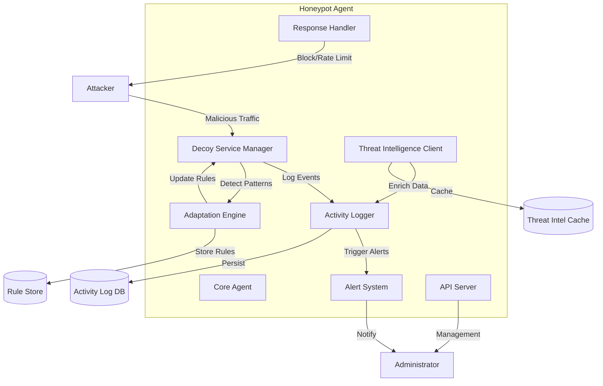

# Design Document: Adaptive Living Honeypot Service Agent

## Overview

The Adaptive Living Honeypot Service Agent is an enterprise-grade cybersecurity SaaS platform that combines AI-driven threat detection with autonomous deception workflows. The system consists of several key components:

- **Core Agent**: Orchestrates all honeypot operations and manages component lifecycle
- **Hybrid Scoring Engine**: Combines rule-based and AI/ML signals to calculate real-time suspicious scores (0-100)
- **Autonomous AI Agent**: Continuously evaluates threats and triggers deception workflows automatically
- **Decoy Service Manager**: Creates and manages fake services that attract attackers
- **Decoy File Generator**: Creates realistic fake files (documents, credentials, configs) with context-aware metadata
- **Activity Logger**: Captures and persists all interactions with honeypots and decoys
- **Adaptation Engine**: Learns from observed attacks and evolves detection rules using ML feedback loops
- **Alert System**: Provides real-time notifications for security events
- **Response Handler**: Executes automated defensive actions
- **Threat Intelligence Client**: Integrates external threat data
- **API Server**: Exposes REST APIs for management and data access
- **React Dashboard**: Modern SaaS UI with real-time visualizations, role-based views, and smooth animations
- **WebSocket Server**: Enables real-time dashboard updates and streaming data
- **Feature Flag Service**: Controls deception workflows and feature rollouts
- **Integration Hub**: Provides hooks for SIEM/SOAR tools

The system is designed to be portable, horizontally scalable, production-ready, and secure by default with comprehensive audit logging.

## Architecture

### High-Level Architecture



### Component Interaction Flow

1. **Attack Detection Flow**:
   - Attacker connects to Decoy Service
   - Decoy Service logs connection details
   - Activity Logger persists event data
   - Adaptation Engine analyzes patterns
   - Alert System notifies administrators if threshold met

2. **Adaptation Flow**:
   - Adaptation Engine monitors Activity Log
   - Identifies recurring Attack Patterns
   - Creates new detection rules
   - Distributes rules to all Decoy Services
   - Tracks rule effectiveness over time

3. **Response Flow**:
   - Attack detected by Decoy Service
   - Response Handler evaluates configured actions
   - Executes response (rate limit, block, etc.)
   - Logs response action
   - Updates attacker profile

## Components and Interfaces

### Core Agent

**Responsibilities**:
- Initialize and coordinate all components
- Manage configuration loading and reloading
- Provide health check endpoints
- Handle graceful shutdown

**Interface**:
```
class CoreAgent:
    def start() -> Result[None, Error]
    def stop() -> Result[None, Error]
    def reload_config(config: Config) -> Result[None, Error]
    def health_check() -> HealthStatus
    def get_status() -> AgentStatus
```

### Decoy Service Manager

**Responsibilities**:
- Create and manage decoy services (HTTP, SSH, FTP, database)
- Bind services to network ports
- Generate realistic protocol responses
- Apply detection rules to incoming traffic
- Isolate decoys from real system resources

**Interface**:
```
class DecoyServiceManager:
    def create_decoy(service_type: ServiceType, config: DecoyConfig) -> Result[DecoyService, Error]
    def remove_decoy(service_id: str) -> Result[None, Error]
    def list_decoys() -> List[DecoyService]
    def apply_rules(rules: List[DetectionRule]) -> Result[None, Error]

class DecoyService:
    def start() -> Result[None, Error]
    def stop() -> Result[None, Error]
    def handle_connection(conn: Connection) -> Response
    def get_metrics() -> ServiceMetrics
```

**Service Types**:
- HTTP/HTTPS: Simulates web servers with fake login pages, admin panels
- SSH: Simulates SSH servers with fake authentication
- FTP: Simulates file transfer services
- Database: Simulates MySQL/PostgreSQL with fake schemas

### Activity Logger

**Responsibilities**:
- Capture all honeypot interactions
- Persist events to storage
- Support querying and filtering
- Manage log rotation and archival
- Enrich events with threat intelligence

**Interface**:
```
class ActivityLogger:
    def log_event(event: SecurityEvent) -> Result[None, Error]
    def query_events(filter: EventFilter) -> Result[List[SecurityEvent], Error]
    def export_events(format: ExportFormat, filter: EventFilter) -> Result[bytes, Error]
    def archive_old_events(before_date: DateTime) -> Result[int, Error]

class SecurityEvent:
    timestamp: DateTime
    source_ip: IPAddress
    source_port: int
    target_service: str
    event_type: EventType
    payload: bytes
    threat_profile_id: Optional[str]
    threat_intel_match: Optional[ThreatIntelMatch]
```

**Storage**:
- Primary: SQLite for single-node deployments, PostgreSQL for distributed
- Archive: Compressed JSON files for long-term storage
- Retention: 90 days in primary storage, indefinite in archive

### Adaptation Engine

**Responsibilities**:
- Analyze Activity Log for patterns
- Create and manage detection rules
- Track rule effectiveness (confidence scores)
- Remove ineffective or stale rules
- Distribute rule updates to Decoy Services

**Interface**:
```
class AdaptationEngine:
    def analyze_patterns() -> List[AttackPattern]
    def create_rule(pattern: AttackPattern) -> DetectionRule
    def update_rule_confidence(rule_id: str, confidence: float) -> Result[None, Error]
    def remove_stale_rules(inactive_days: int) -> int
    def get_active_rules() -> List[DetectionRule]

class DetectionRule:
    id: str
    pattern: AttackPattern
    confidence: float  # 0.0 to 1.0
    created_at: DateTime
    last_matched: DateTime
    match_count: int

class AttackPattern:
    signature: bytes
    pattern_type: PatternType  # regex, exact_match, behavioral
    severity: Severity  # low, medium, high, critical
```

**Pattern Detection Algorithm**:
1. Group events by source IP and time window (24 hours)
2. Extract common features (payload signatures, request sequences)
3. Calculate frequency and consistency
4. Generate rule if frequency > 5 and consistency > 0.7
5. Assign initial confidence score based on pattern clarity

### Alert System

**Responsibilities**:
- Evaluate alert rules against security events
- Send notifications via configured channels
- Aggregate multiple alerts to reduce noise
- Track alert delivery status

**Interface**:
```
class AlertSystem:
    def register_channel(channel: AlertChannel) -> Result[None, Error]
    def evaluate_event(event: SecurityEvent) -> Result[None, Error]
    def send_alert(alert: Alert) -> Result[None, Error]
    def get_alert_history(filter: AlertFilter) -> List[Alert]

class Alert:
    id: str
    severity: Severity
    title: str
    description: str
    source_events: List[str]  # event IDs
    timestamp: DateTime
    delivered: bool

interface AlertChannel:
    def send(alert: Alert) -> Result[None, Error]
    def test_connection() -> Result[None, Error]
```

**Supported Channels**:
- Email: SMTP with TLS support
- Webhook: HTTP POST with JSON payload
- Syslog: RFC 5424 format
- Custom: Plugin interface for extensions

### Response Handler

**Responsibilities**:
- Execute automated response actions
- Manage IP blocklists and allowlists
- Implement rate limiting
- Track response effectiveness

**Interface**:
```
class ResponseHandler:
    def execute_response(action: ResponseAction, target: IPAddress) -> Result[None, Error]
    def add_to_blocklist(ip: IPAddress, duration: Duration) -> Result[None, Error]
    def add_to_allowlist(ip: IPAddress) -> Result[None, Error]
    def is_blocked(ip: IPAddress) -> bool
    def is_allowed(ip: IPAddress) -> bool
    def get_active_blocks() -> List[BlockEntry]

class ResponseAction:
    action_type: ActionType  # block, rate_limit, drop_connection, tarpit
    duration: Optional[Duration]
    parameters: Dict[str, Any]
```

**Response Actions**:
- **Block**: Add IP to firewall/iptables rules
- **Rate Limit**: Throttle connections from source
- **Drop Connection**: Immediately close connection
- **Tarpit**: Slow down responses to waste attacker time

### Threat Intelligence Client

**Responsibilities**:
- Fetch threat intelligence feeds
- Parse STIX 2.0 format
- Cache threat data locally
- Enrich security events with threat context
- Monitor feed freshness

**Interface**:
```
class ThreatIntelligenceClient:
    def fetch_feeds() -> Result[None, Error]
    def lookup_ip(ip: IPAddress) -> Optional[ThreatIntelMatch]
    def get_feed_status() -> List[FeedStatus]
    def update_schedule(interval: Duration) -> Result[None, Error]

class ThreatIntelMatch:
    ip: IPAddress
    threat_type: str
    confidence: float
    source_feed: str
    last_seen: DateTime
    description: str
```

### API Server

**Responsibilities**:
- Expose REST API for management
- Provide authentication and authorization
- Support data export endpoints
- Enable configuration updates

**Interface**:
```
API Endpoints:

GET /api/v1/status
  - Returns agent health and status

GET /api/v1/events?filter=...
  - Query security events with filtering

POST /api/v1/events/export
  - Export events in JSON/CSV format

GET /api/v1/decoys
  - List active decoy services

POST /api/v1/decoys
  - Create new decoy service

DELETE /api/v1/decoys/{id}
  - Remove decoy service

GET /api/v1/rules
  - List active detection rules

POST /api/v1/config/reload
  - Reload configuration

GET /api/v1/alerts
  - Query alert history

POST /api/v1/response/block
  - Manually block an IP address
```

**Authentication**:
- API Key: Header-based authentication
- OAuth 2.0: Token-based for integrations
- Rate limiting: 1000 requests per hour per key

## Data Models

### Configuration Model

```
class Config:
    agent:
        listen_address: str
        api_port: int
        log_level: str
    
    decoys:
        - type: ServiceType
          port: int
          config: Dict[str, Any]
    
    logging:
        storage_type: str  # sqlite, postgresql
        connection_string: str
        retention_days: int
        archive_path: str
    
    adaptation:
        enabled: bool
        pattern_threshold: int
        confidence_threshold: float
        inactive_days: int
    
    alerting:
        channels:
            - type: str
              config: Dict[str, Any]
        rules:
            - severity: Severity
              conditions: Dict[str, Any]
    
    response:
        enabled: bool
        default_action: ActionType
        block_duration: Duration
        allowlist: List[IPAddress]
    
    threat_intelligence:
        enabled: bool
        feeds:
            - url: str
              format: str
              update_interval: Duration
```

### Database Schema

**events table**:
```sql
CREATE TABLE events (
    id TEXT PRIMARY KEY,
    timestamp DATETIME NOT NULL,
    source_ip TEXT NOT NULL,
    source_port INTEGER NOT NULL,
    target_service TEXT NOT NULL,
    event_type TEXT NOT NULL,
    payload BLOB,
    threat_profile_id TEXT,
    threat_intel_match TEXT,
    INDEX idx_timestamp (timestamp),
    INDEX idx_source_ip (source_ip),
    INDEX idx_event_type (event_type)
);
```

**detection_rules table**:
```sql
CREATE TABLE detection_rules (
    id TEXT PRIMARY KEY,
    pattern_signature BLOB NOT NULL,
    pattern_type TEXT NOT NULL,
    severity TEXT NOT NULL,
    confidence REAL NOT NULL,
    created_at DATETIME NOT NULL,
    last_matched DATETIME,
    match_count INTEGER DEFAULT 0,
    active BOOLEAN DEFAULT 1
);
```

**threat_intel_cache table**:
```sql
CREATE TABLE threat_intel_cache (
    ip TEXT PRIMARY KEY,
    threat_type TEXT NOT NULL,
    confidence REAL NOT NULL,
    source_feed TEXT NOT NULL,
    last_seen DATETIME NOT NULL,
    description TEXT,
    expires_at DATETIME NOT NULL
);
```

**blocklist table**:
```sql
CREATE TABLE blocklist (
    ip TEXT PRIMARY KEY,
    blocked_at DATETIME NOT NULL,
    expires_at DATETIME NOT NULL,
    reason TEXT,
    active BOOLEAN DEFAULT 1
);
```


## Correctness Properties

*A property is a characteristic or behavior that should hold true across all valid executions of a system—essentially, a formal statement about what the system should do. Properties serve as the bridge between human-readable specifications and machine-verifiable correctness guarantees.*

### Core Logging Properties

**Property 1: Complete event logging**
*For any* connection attempt to a Decoy_Service, the Activity_Logger should create a log entry containing source IP, timestamp, target service, and complete payload data without truncation.
**Validates: Requirements 1.1, 1.2**

**Property 2: Attack correlation**
*For any* sequence of attack attempts from the same source IP within a 24-hour window, the Honeypot_Agent should correlate them into a single Threat_Profile with all events linked.
**Validates: Requirements 1.3**

### Adaptation Engine Properties

**Property 3: Pattern-based rule creation**
*For any* Attack_Pattern that occurs more than 5 times within 24 hours, the Adaptation_Engine should create a corresponding DetectionRule with an initial confidence score between 0.0 and 1.0.
**Validates: Requirements 2.1, 2.4**

**Property 4: Rule lifecycle management**
*For any* DetectionRule that has not matched an attack for 30 days, the Adaptation_Engine should mark it as inactive, and for any rule with confidence below 0.3, the engine should remove it entirely.
**Validates: Requirements 2.2, 2.5**

**Property 5: Rule distribution timing**
*For any* newly created DetectionRule, all active Decoy_Services should have the rule applied and active within 60 seconds of creation.
**Validates: Requirements 2.3**

**Property 6: Confidence score invariant**
*For any* DetectionRule at any point in time, its confidence score should be between 0.0 and 1.0 inclusive.
**Validates: Requirements 2.4**

### Decoy Service Properties

**Property 7: Port binding**
*For any* Decoy_Service created with a valid port configuration, the service should successfully bind to the specified port and accept connections on that port.
**Validates: Requirements 3.2**

**Property 8: Protocol compliance**
*For any* valid protocol request sent to a Decoy_Service, the response should be compliant with the protocol specification (HTTP, SSH, FTP, or database protocol).
**Validates: Requirements 3.3**

**Property 9: Configuration round-trip**
*For any* valid configuration object (YAML or JSON), serializing then deserializing should produce an equivalent configuration that results in identical agent behavior.
**Validates: Requirements 3.4, 5.5, 9.1**

**Property 10: Resource isolation**
*For any* operation performed by a Decoy_Service, the operation should not access real system resources (files, databases, network services) outside the honeypot sandbox.
**Validates: Requirements 3.5**

### Alert System Properties

**Property 11: Alert delivery completeness**
*For any* high-severity attack detected, the Alert_System should send a notification within 5 seconds containing source IP, target service, and threat severity.
**Validates: Requirements 4.1, 4.5**

**Property 12: Alert aggregation**
*For any* set of alerts triggered within a 60-second window, if the count exceeds 1, the Alert_System should aggregate them into a single notification with all source events referenced.
**Validates: Requirements 4.3**

**Property 13: Custom rule evaluation**
*For any* configured alert rule and any security event, the Alert_System should evaluate the rule against the event and trigger an alert if conditions match.
**Validates: Requirements 4.4**

### Threat Intelligence Properties

**Property 14: STIX 2.0 round-trip**
*For any* valid STIX 2.0 threat intelligence document, parsing then serializing should produce an equivalent document that results in identical threat matching behavior.
**Validates: Requirements 6.1**

**Property 15: Threat intelligence enrichment**
*For any* security event where the source IP exists in the threat intelligence database, the Activity_Logger should enrich the event with threat context and flag it as high-priority.
**Validates: Requirements 6.2, 6.5**

**Property 16: Staleness detection**
*For any* threat intelligence data with a timestamp older than 48 hours, the Honeypot_Agent should log a warning about stale data.
**Validates: Requirements 6.4**

### Response Handler Properties

**Property 17: Response action execution and logging**
*For any* detected attack that triggers a response action, the Response_Handler should execute the configured action (block, rate_limit, drop, tarpit) and create a log entry documenting the action taken.
**Validates: Requirements 7.1, 7.3**

**Property 18: Block duration enforcement**
*For any* IP address blocked with a specified duration, the IP should remain blocked for exactly that duration (within 1 second tolerance) and then be automatically unblocked.
**Validates: Requirements 7.2**

**Property 19: Allowlist protection**
*For any* IP address in the allowlist, regardless of attack behavior, the Response_Handler should never block the IP but should log all malicious activity from that IP.
**Validates: Requirements 7.4, 7.5**

### Data Export Properties

**Property 20: Export filtering accuracy**
*For any* export request with filters (date range, source IP, attack type), the exported data should contain only events matching all specified filter criteria.
**Validates: Requirements 8.3**

**Property 21: API authentication enforcement**
*For any* REST API request without valid authentication (API key or OAuth token), the API_Server should reject the request with 401 status, and for any request with valid authentication, the server should process it normally.
**Validates: Requirements 8.4, 8.5**

### Configuration Management Properties

**Property 22: Configuration validation**
*For any* configuration file with invalid parameters (out-of-range values, missing required fields, type mismatches), the Honeypot_Agent should reject the configuration at load time with a descriptive error message.
**Validates: Requirements 9.3**

**Property 23: Hot reload consistency**
*For any* configuration update applied while the agent is running, the new settings should take effect without restart and without disrupting existing connections or losing in-flight events.
**Validates: Requirements 9.2**

## Error Handling

### Error Categories

1. **Network Errors**:
   - Connection failures to decoy services
   - Port binding conflicts
   - Network timeout conditions
   - **Handling**: Log error, retry with exponential backoff, alert if persistent

2. **Storage Errors**:
   - Database connection failures
   - Disk space exhaustion
   - Write failures
   - **Handling**: Buffer events in memory (up to 10,000), alert immediately, attempt recovery

3. **Configuration Errors**:
   - Invalid configuration syntax
   - Missing required parameters
   - Out-of-range values
   - **Handling**: Reject configuration, log detailed error, maintain previous valid configuration

4. **Adaptation Errors**:
   - Pattern detection failures
   - Rule creation conflicts
   - Confidence calculation errors
   - **Handling**: Log error, skip problematic pattern, continue with other patterns

5. **Alert Delivery Errors**:
   - Channel connection failures
   - Authentication failures
   - Rate limit exceeded
   - **Handling**: Retry up to 3 times, log failure, queue for later delivery

6. **Threat Intelligence Errors**:
   - Feed fetch failures
   - Parse errors
   - Stale data
   - **Handling**: Use cached data, log warning, retry on next scheduled update

### Error Recovery Strategies

**Graceful Degradation**:
- If Activity_Logger fails, buffer events in memory
- If Adaptation_Engine fails, continue with existing rules
- If Alert_System fails, log alerts locally
- If Threat_Intelligence fails, operate without enrichment

**Circuit Breaker Pattern**:
- After 5 consecutive failures, open circuit for 5 minutes
- Prevents cascading failures
- Applies to external dependencies (threat feeds, alert channels)

**Health Monitoring**:
- Each component reports health status
- Core Agent aggregates health information
- Health check endpoint returns degraded status if any component unhealthy

## Testing Strategy

### Dual Testing Approach

The testing strategy employs both unit tests and property-based tests as complementary approaches:

- **Unit tests**: Verify specific examples, edge cases, and error conditions
- **Property tests**: Verify universal properties across all inputs using randomized testing

Both are necessary for comprehensive coverage. Unit tests catch concrete bugs in specific scenarios, while property tests verify general correctness across the input space.

### Property-Based Testing

**Framework Selection**:
- **Python**: Use Hypothesis library
- **TypeScript/JavaScript**: Use fast-check library
- **Go**: Use gopter library
- **Rust**: Use proptest library

**Configuration**:
- Minimum 100 iterations per property test (due to randomization)
- Each test must reference its design document property
- Tag format: `Feature: adaptive-honeypot-agent, Property {number}: {property_text}`

**Example Property Test Structure**:
```python
from hypothesis import given, strategies as st

# Feature: adaptive-honeypot-agent, Property 1: Complete event logging
@given(
    source_ip=st.ip_addresses(),
    payload=st.binary(min_size=0, max_size=10000)
)
def test_complete_event_logging(source_ip, payload):
    # Create connection with random IP and payload
    event = simulate_connection(source_ip, payload)
    
    # Verify log entry exists with all required fields
    log_entry = activity_logger.query_events(event_id=event.id)
    assert log_entry.source_ip == source_ip
    assert log_entry.payload == payload
    assert log_entry.timestamp is not None
    assert len(log_entry.payload) == len(payload)  # No truncation
```

### Unit Testing Strategy

**Focus Areas**:
- Edge cases (empty payloads, maximum sizes, boundary values)
- Error conditions (network failures, invalid input, resource exhaustion)
- Integration points (component interactions, API contracts)
- Specific examples demonstrating correct behavior

**Coverage Goals**:
- Core components: 90% code coverage
- Critical paths (logging, alerting): 95% code coverage
- Error handling: 85% code coverage

**Test Organization**:
```
tests/
  unit/
    test_core_agent.py
    test_decoy_service_manager.py
    test_activity_logger.py
    test_adaptation_engine.py
    test_alert_system.py
    test_response_handler.py
    test_threat_intelligence.py
    test_api_server.py
  
  property/
    test_logging_properties.py
    test_adaptation_properties.py
    test_decoy_properties.py
    test_alert_properties.py
    test_threat_intel_properties.py
    test_response_properties.py
    test_config_properties.py
  
  integration/
    test_end_to_end_flows.py
    test_component_integration.py
    test_deployment_modes.py
```

### Integration Testing

**Scenarios**:
1. Full attack flow: Connection → Detection → Logging → Adaptation → Alert → Response
2. Configuration reload: Update config → Verify changes applied → Verify no disruption
3. Threat intelligence integration: Fetch feed → Enrich events → Verify flagging
4. Multi-decoy coordination: Create multiple decoys → Apply rules → Verify consistency
5. Performance under load: Generate high traffic → Verify stability → Check resource usage

### Performance Testing

**Benchmarks**:
- 1,000 concurrent connections sustained for 10 minutes
- 10,000 events per minute processing rate
- <100ms logging latency at 95th percentile
- <512MB memory footprint under normal load
- <5 seconds alert delivery for high-severity events

**Load Testing Tools**:
- Apache JMeter for HTTP decoy load testing
- Custom scripts for SSH/FTP/database protocol testing
- Memory profiling with valgrind or language-specific tools

### Security Testing

**Penetration Testing**:
- Verify decoy isolation (cannot access real resources)
- Test authentication bypass attempts on API
- Verify allowlist cannot be circumvented
- Test for injection vulnerabilities in logging

**Fuzzing**:
- Fuzz decoy service inputs with malformed protocol data
- Fuzz configuration parser with invalid YAML/JSON
- Fuzz STIX 2.0 parser with malformed threat intelligence data

## Implementation Notes

### Technology Stack Recommendations

**Core Language Options**:
- **Python**: Excellent library support, rapid development, good for prototyping
- **Go**: High performance, excellent concurrency, good for production deployments
- **Rust**: Maximum performance and safety, steeper learning curve

**Dependencies**:
- Database: SQLite (single-node) or PostgreSQL (distributed)
- Web framework: FastAPI (Python), Gin (Go), Actix (Rust)
- Configuration: PyYAML/pyyaml (Python), gopkg.in/yaml.v3 (Go), serde_yaml (Rust)
- Testing: Hypothesis (Python), gopter (Go), proptest (Rust)

### Deployment Considerations

**Container Deployment**:
- Provide Dockerfile with minimal base image
- Mount configuration as volume
- Expose API port and decoy ports
- Use health check endpoint for container orchestration

**System Service Deployment**:
- Provide systemd unit file (Linux)
- Provide launchd plist (macOS)
- Provide Windows Service wrapper
- Run as non-privileged user with capability grants for port binding

**Standalone Deployment**:
- Single binary with embedded configuration
- Command-line flags for common options
- Interactive setup wizard for first-time configuration

### Security Considerations

**Principle of Least Privilege**:
- Run agent as dedicated user with minimal permissions
- Use capability grants (CAP_NET_BIND_SERVICE) instead of root
- Sandbox decoy services with seccomp/AppArmor/SELinux

**Data Protection**:
- Encrypt Activity_Log at rest
- Encrypt API communication with TLS
- Sanitize logs to remove sensitive data
- Implement data retention policies

**Operational Security**:
- Rotate API keys regularly
- Monitor for honeypot detection attempts
- Implement rate limiting on all external interfaces
- Regular security audits and updates
