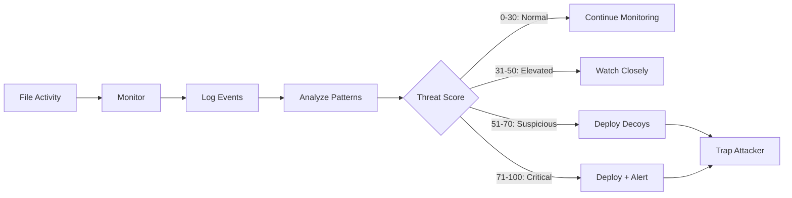

<div align="center">

# 🛡️ Adaptive File System Honeypot Agent

### *An Intelligent Security System That Learns and Adapts*

[](https://www.python.org/downloads/)
[]()
[]()
[]()

**Final Year Diploma Project - 2025**  
*Aryan Jakkal & Dhairayshil Sarwade*

[Features](#-key-features) • [Installation](#-installation) • [Usage](#-usage) • [Progress](#-development-progress) • [Documentation](#-documentation)

</div>

---

## 🎯 Project Vision

Imagine a security system that doesn't just watch—it **thinks**. Our Adaptive File System Honeypot doesn't wait for attacks to happen; it **predicts** them, **adapts** to them, and **traps** attackers in their own game.

This isn't just monitoring. This is **intelligent defense**.

---

## 🌟 Key Features

<table>
<tr>
<td width="50%">

### 🔍 Real-Time Monitoring
Continuously watches your file system, detecting every creation, modification, and deletion in milliseconds.

**Technology:** Watchdog library with Observer pattern

</td>
<td width="50%">

### 🧠 Intelligent Threat Detection
Analyzes behavior patterns using a sophisticated scoring algorithm. Knows the difference between a user and an attacker.

**Algorithm:** Multi-rule scoring system (0-100 scale)

</td>
</tr>
<tr>
<td width="50%">

### 🎭 Adaptive Decoy Deployment
Automatically creates convincing fake files when threats are detected. Attackers think they found gold—but it's a trap.

**Strategy:** Context-aware decoy generation

</td>
<td width="50%">

### 🚨 Smart Alert System
Instant notifications when attackers access decoys. You know exactly when and how they're trying to breach your system.

**Response:** Multi-level alerting (Elevated → Critical)

</td>
</tr>
</table>

---

## 🎬 How It Works



### The Intelligence Behind It

1. **👀 Observe** - Monitor every file system event in real-time
2. **🧮 Analyze** - Calculate threat scores using multiple detection rules
3. **🎯 Detect** - Identify suspicious patterns (rapid access, unusual times, sensitive files)
4. **🎭 Deceive** - Deploy realistic decoy files to trap attackers
5. **📢 Alert** - Notify administrators when decoys are accessed

---

## 🚀 Current Features (Implemented)

### ✅ Phase 1: Foundation (86% Complete)

<details open>
<summary><b>🔧 Day 1-2: Project Setup</b></summary>

```
✓ Virtual environment configured
✓ Project structure created  
✓ Dependencies installed (watchdog, pyyaml, faker, pytest)
✓ Git repository initialized
```

**Status:** 🟢 Complete

</details>

<details open>
<summary><b>👁️ Day 3-4: File Monitoring System</b></summary>

```python
# Real-time file system monitoring
class FileMonitor(FileSystemEventHandler):
    def on_created(self, event):   # Detects new files
    def on_modified(self, event):  # Detects changes
    def on_deleted(self, event):   # Detects deletions
```

**Features:**
- 🔄 Continuous monitoring using Observer pattern
- 📁 Recursive directory watching
- ⚡ Instant event detection
- 🧪 Comprehensive test suite

**Files:** `src/monitor/file_monitor.py`  
**Status:** 🟢 Complete

</details>

<details open>
<summary><b>📝 Day 5-6: Event Logging System</b></summary>

```python
# Professional logging with timestamps
logger.log_info("File created: document.txt")
logger.log_warning("Suspicious activity detected")
logger.log_error("System error occurred")
```

**Features:**
- ⏰ Automatic timestamps
- 📊 Multiple log levels (INFO, WARNING, ERROR)
- 💾 Persistent file-based logging
- � Integrated with FileMonitor

**Files:** `src/monitor/logger.py`  
**Status:** 🟢 Complete

</details>

<details open>
<summary><b>🧪 Day 7-8: Testing & Quality Assurance</b></summary>

```bash
✓ 4/4 tests passing
✓ Logger creation and log levels verified
✓ FileMonitor and event handling tested
✓ Mock objects for isolated testing
```

**Features:**
- ✅ Comprehensive test suite
- 🎭 Mock objects for testing
- 🐛 Bug fixes and code quality improvements
- 📈 100% test pass rate

**Files:** `tests/simple_test.py`  
**Status:** 🟢 Complete

</details>

<details open>
<summary><b>🧠 Day 9-10: Threat Detection Algorithm</b></summary>

```python
# Intelligent threat scoring
Score = rapid_access(+20) + unusual_time(+15) + 
        sensitive_files(+25) + deletions(+30)

if score >= 71:  return "Critical"   # 🔴 Deploy + Alert
elif score >= 51: return "Suspicious" # 🟠 Deploy Decoys
elif score >= 31: return "Elevated"   # 🟡 Watch Closely
else: return "Normal"                 # 🟢 Continue
```

**Detection Rules:**
- ⚡ **Rapid Access:** 5+ files in 10 seconds → +20 points
- 🌙 **Unusual Time:** Activity at midnight-5AM → +15 points
- 🔐 **Sensitive Files:** passwords, keys, configs → +25 points
- 🗑️ **Mass Deletion:** 3+ files in 30 seconds → +30 points

**Threat Levels:**
- 🟢 **Normal (0-30):** Regular activity
- 🟡 **Elevated (31-50):** Slightly unusual
- 🟠 **Suspicious (51-70):** Likely threat - Deploy decoys
- 🔴 **Critical (71-100):** Active attack - Deploy + Alert

**Files:** `src/monitor/threat_detector.py`  
**Status:** 🟢 Complete

</details>

<details open>
<summary><b>🔗 Day 11-12: System Integration</b></summary>

```python
# Real-time threat detection integrated with monitoring
class FileMonitor(FileSystemEventHandler):
    def __init__(self):
        self.threat_detector = ThreatDetector()  # Integration!
    
    def on_created(self, event):
        self.logger.log_info(f"File Created: {event.src_path}")
        
        # Analyze threat in real-time
        self.threat_detector.add_event("created", event.src_path)
        threat_level = self.threat_detector.get_threat_level()
        threat_score = self.threat_detector.threat_score
        
        # Warn if suspicious
        if threat_score >= 31:
            self.logger.log_warning(
                f"Threat Level: {threat_level} (Score: {threat_score})"
            )
```

**Features:**
- 🔗 FileMonitor + ThreatDetector working together
- ⚡ Real-time threat analysis on every file event
- 🚨 Automatic warnings for suspicious activity (score >= 31)
- 🎯 All event types integrated (created, modified, deleted)

**What Changed:**
- Added `ThreatDetector` instance to `FileMonitor`
- Updated all event handlers to analyze threats
- Implemented automatic warning system
- Fixed configuration issues (pyproject.toml)

**Files:** `src/monitor/file_monitor.py`  
**Status:** 🟢 Complete

</details>

---

## 🔄 In Progress

### 🔨 Day 13-14: Week 2 Review (Next)

```
⏳ Review all Week 1-2 code
⏳ Fix any remaining bugs
⏳ Update all documentation
⏳ Comprehensive system testing
⏳ Prepare for Week 3 (Decoy system)
```

---

## 📊 Development Progress

<div align="center">

### Overall Progress: 21% Complete

```
██████████░░░░░░░░░░░░░░░░░░░░░░░░░░░░░░░░░░░░░░ 12/56 days
```

</div>

### 📅 Development Timeline

<table>
<tr>
<th width="25%">Phase</th>
<th width="50%">Tasks</th>
<th width="25%">Status</th>
</tr>

<tr>
<td><b>Week 1-2</b><br/>Foundation</td>
<td>
✅ Project setup<br/>
✅ File monitoring<br/>
✅ Event logging<br/>
✅ Testing system<br/>
✅ Threat detection<br/>
✅ System integration<br/>
⏳ Week review
</td>
<td>
<b>86%</b><br/>
🟢 6/7 days
</td>
</tr>

<tr>
<td><b>Week 3-4</b><br/>Core Features</td>
<td>
⏳ Decoy generator<br/>
⏳ Decoy deployment<br/>
⏳ Decoy tracking<br/>
⏳ Alert system<br/>
⏳ Email alerts<br/>
⏳ Integration testing<br/>
⏳ Week review
</td>
<td>
<b>0%</b><br/>
⚪ 0/7 days
</td>
</tr>

<tr>
<td><b>Week 5-6</b><br/>Service & Dashboard</td>
<td>
⏳ Windows service<br/>
⏳ Service testing<br/>
⏳ Web dashboard<br/>
⏳ Dashboard features<br/>
⏳ Real-time updates<br/>
⏳ Polish & optimization<br/>
⏳ Week review
</td>
<td>
<b>0%</b><br/>
⚪ 0/7 days
</td>
</tr>

<tr>
<td><b>Week 7-8</b><br/>Finalization</td>
<td>
⏳ System testing<br/>
⏳ Bug fixes<br/>
⏳ Performance testing<br/>
⏳ Documentation<br/>
⏳ User guide<br/>
⏳ Presentation prep<br/>
⏳ Final review
</td>
<td>
<b>0%</b><br/>
⚪ 0/14 days
</td>
</tr>
</table>

---

## 🏆 Milestones

- [x] 🎯 **Milestone 1:** Project Foundation (Day 1-2) ✅
- [x] 🎯 **Milestone 2:** Monitoring System (Day 3-8) ✅
- [ ] 🎯 **Milestone 3:** Threat Detection (Day 9-14) - 50% complete
- [ ] 🎯 **Milestone 4:** Decoy System (Day 15-22)
- [ ] 🎯 **Milestone 5:** Alert System (Day 23-28)
- [ ] 🎯 **Milestone 6:** Service Deployment (Day 29-36)
- [ ] 🎯 **Milestone 7:** Dashboard (Day 37-42)
- [ ] 🎯 **Milestone 8:** Project Complete! (Day 43-56)

---

## 🛠️ Technology Stack

<div align="center">

| Category | Technology | Purpose |
|----------|-----------|---------|
| **Language** |  | Core development |
| **Monitoring** |  | File system events |
| **Config** |  | Configuration management |
| **Data Gen** |  | Decoy file generation |
| **Testing** |  | Unit testing |
| **Version Control** |  | Source control |

</div>

---

## 📁 Project Structure

```
Adaptive-Honeypot-Security-Agent/
│
├── 📂 src/                      # Source code
│   ├── 📂 agent/                # Main agent entry point
│   ├── 📂 monitor/              # Monitoring system ✅
│   │   ├── file_monitor.py     # File system monitoring
│   │   ├── logger.py            # Event logging
│   │   └── threat_detector.py  # Threat detection
│   ├── 📂 decoy/                # Decoy generation (coming soon)
│   └── 📂 alert/                # Alert system (coming soon)
│
├── 📂 config/                   # Configuration files
│   └── config.yaml              # Main configuration
│
├── 📂 tests/                    # Test suite
│   └── simple_test.py           # Unit tests ✅
│
├── 📂 logs/                     # Log files (auto-generated)
│   └── events.log               # Event logs
│
├── 📂 docs/                     # Documentation (private)
│   ├── 1_DAILY_TASKS.md         # Task tracking
│   ├── 2_PROGRESS_TRACKER.md    # Progress tracking
│   └── 3_LEARNING_NOTES.md      # Learning notes
│
└── 📄 README.md                 # This file
```

---

## 💻 Installation

### Prerequisites

- **Python 3.10+** - [Download here](https://www.python.org/downloads/)
- **Git** - [Download here](https://git-scm.com/downloads)

### Quick Start

```bash
# 1️⃣ Clone the repository
git clone https://github.com/ARYANJAKKAL123/Adaptive-Honeypot-Security-Agent.git
cd Adaptive-Honeypot-Security-Agent

# 2️⃣ Create virtual environment
python -m venv venv

# 3️⃣ Activate virtual environment
# Windows:
venv\Scripts\activate
# Mac/Linux:
source venv/bin/activate

# 4️⃣ Install dependencies
pip install -e ".[dev]"

# 5️⃣ Verify installation
python -c "from src.monitor.file_monitor import FileMonitor; print('✅ Installation successful!')"
```

---

## 🎮 Usage

### Run File Monitor

```bash
# Start monitoring a directory
python src/monitor/file_monitor.py
```

**What it does:**
1. Creates a `test_monitor` folder
2. Starts watching for file changes
3. Logs all events to console and file
4. Press `Ctrl+C` to stop

### Run Threat Detector

```bash
# Test the threat detection system
python src/monitor/threat_detector.py
```

**What it does:**
1. Runs 4 test scenarios
2. Shows threat scores in real-time
3. Demonstrates different threat levels
4. Displays final threat analysis

### Run Tests

```bash
# Run all tests
pytest

# Run with verbose output
pytest -v

# Run specific test file
pytest tests/simple_test.py
```

---

## 📖 Documentation

### For Developers

- **📘 Code Documentation:** Inline comments and docstrings in all source files
- **📗 API Reference:** See individual module docstrings
- **📙 Configuration Guide:** Check `config/config.yaml`

### For Learning

- **📚 Daily Tasks:** `docs/1_DAILY_TASKS.md` - Track your progress
- **📊 Progress Tracker:** `docs/2_PROGRESS_TRACKER.md` - See overall progress
- **📝 Learning Notes:** `docs/3_LEARNING_NOTES.md` - Reference and notes
- **🔍 Detailed Explanations:** `docs/explanations/` - Deep dives into each component

---

## 🎯 Project Goals

### 🎓 Educational Goals

- ✅ Learn file system monitoring techniques
- ✅ Understand threat detection algorithms
- ✅ Practice Python OOP and design patterns
- 🔄 Build a complete, working security tool
- 🔄 Gain experience with real-world security concepts

### 🔧 Technical Goals

- ✅ Real-time file system monitoring
- ✅ Intelligent threat scoring
- 🔄 Adaptive threat response
- 🔄 Deployable security agent
- 🔄 Professional code quality

---

## 📝 Recent Updates

<details>
<summary><b>📅 February 17, 2026</b> - Day 9-10 Complete</summary>

### ✨ What's New
- ✅ Implemented complete threat detection algorithm
- ✅ Created ThreatDetector class with 10 methods
- ✅ Added 4 detection rules (rapid access, unusual time, sensitive files, deletions)
- ✅ Implemented threat level categories (Normal, Elevated, Suspicious, Critical)
- ✅ Built comprehensive test scenarios
- 📊 Progress: 14% → 18%

### 🔧 Technical Details
- **Lines of Code:** 268 lines in threat_detector.py
- **Detection Rules:** 4 rules with configurable thresholds
- **Scoring Range:** 0-100 with automatic capping
- **Test Coverage:** 4 test scenarios included

</details>

<details>
<summary><b>📅 February 13, 2026</b> - Day 7-8 Complete</summary>

### ✨ What's New
- ✅ Created comprehensive test suite
- ✅ All 4 tests passing (logger, logging levels, monitor, events)
- ✅ Fixed bugs in imports and indentation
- ✅ Implemented mock objects for testing
- 📊 Progress: 7% → 14%

</details>

<details>
<summary><b>📅 February 8, 2026</b> - Day 5-6 Complete</summary>

### ✨ What's New
- ✅ Implemented EventLogger class
- ✅ Added log levels (INFO, WARNING, ERROR)
- ✅ Integrated logging with FileMonitor
- ✅ All events now logged with timestamps

</details>

---

## 🤝 Contributing

This is a student project for educational purposes. We're not accepting external contributions at this time, but feel free to:

- ⭐ Star the repository
- 🐛 Report bugs via issues
- 💡 Suggest features via issues
- 📖 Learn from the code

---

## 📄 License

**Educational Project** - All rights reserved

This project is developed as part of a Final Year Diploma program and is intended for educational purposes only.

---

## 👥 Authors

<div align="center">

### 🎓 Development Team

<table>
<tr>
<td align="center" width="50%">
<br/>
<b>Aryan Jakkal</b><br/>
<sub>Lead Developer</sub><br/>
<a href="https://github.com/ARYANJAKKAL123">GitHub</a>
</td>
<td align="center" width="50%">
<b>Dhairayshil Sarwade</b><br/>
<sub>Co-Developer</sub><br/>
</td>
</tr>
</table>

**3rd Year Diploma Students**  
**Final Year Project - 2025**

</div>

---

## 🌟 Acknowledgments

Special thanks to:
- **Watchdog** - For the excellent file monitoring library
- **Python Community** - For comprehensive documentation
- **Our Mentors** - For guidance and support

---

<div align="center">

### 🚀 Building the Future of Adaptive Security


[](https://github.com/ARYANJAKKAL123)
[](https://www.python.org/)

---

**Last Updated:** February 17, 2026

*"In cybersecurity, the best defense is an intelligent offense."*

</div>
