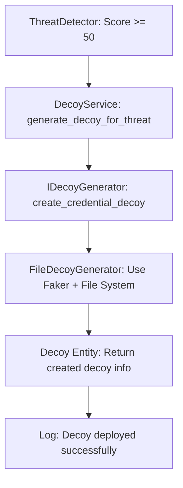

# Day 15-16: Clean Architecture Implementation Guide

**Authors:** Aryan Jakkal & Dhirayshil Sarwade  
**Date:** February 18, 2026  
**Topic:** Decoy File Generator with Clean Architecture

---

## 🎯 What We're Building

We're implementing a **Decoy File Generator** that creates fake files to trap attackers. But instead of just writing code that works, we're using **Clean Architecture** to make it future-proof for UI integration.

---

## 🏗️ Why Clean Architecture?

### The Problem Without Clean Architecture
```
❌ BAD: Everything mixed together
FileMonitor → DecoyGenerator → FileSystem
     ↓              ↓              ↓
   Logger    →   Database   →    Email
```

**Problems:**
- Hard to test
- Hard to change UI later
- Business logic mixed with technical details
- Tightly coupled components

### The Solution: Clean Architecture
```
✅ GOOD: Separated layers
UI Layer (Future) → Application Layer → Domain Layer
                         ↓
                Infrastructure Layer
```

**Benefits:**
- Easy to test each layer
- UI can be added without changing business logic
- Clear separation of concerns
- Loosely coupled components

---

## 📚 Clean Architecture Layers Explained

### 1. 🎯 Domain Layer (Core Business Logic)
**Location:** `src/domain/`

**What it contains:**
- **Entities:** Core business objects (what IS a decoy?)
- **Interfaces:** Contracts (how SHOULD decoys be generated?)

**Rules:**
- ❌ NO external dependencies (no file system, no databases, no UI)
- ✅ Pure Python classes and interfaces
- ✅ Business rules and logic only

**Example:**
```python
# src/domain/entities/decoy.py
@dataclass
class Decoy:
    decoy_type: str      # "credential", "document", etc.
    file_path: str       # Where to place it
    content: str         # What's inside
    created_at: datetime # When it was created
```

### 2. 🔧 Application Layer (Use Cases)
**Location:** `src/application/`

**What it contains:**
- **Services:** Orchestrate business operations
- **Use Cases:** "Generate decoy when threat detected"

**Rules:**
- ✅ Uses Domain Layer (entities, interfaces)
- ❌ NO direct external dependencies
- ✅ Coordinates business operations

**Example:**
```python
# src/application/decoy_service.py
class DecoyService:
    def generate_decoy_for_threat(self, threat_level: str) -> Decoy:
        # Business logic: what type of decoy for this threat?
        if threat_level == "Critical":
            return self.generator.create_credential_decoy()
        else:
            return self.generator.create_document_decoy()
```

### 3. 🔌 Infrastructure Layer (External Dependencies)
**Location:** `src/infrastructure/`

**What it contains:**
- **Implementations:** Actual file creation, Faker usage
- **External Services:** File system, databases, APIs

**Rules:**
- ✅ Implements Domain interfaces
- ✅ Handles all external dependencies
- ✅ Can be swapped out easily

**Example:**
```python
# src/infrastructure/file_decoy_generator.py
class FileDecoyGenerator(IDecoyGenerator):  # Implements interface
    def __init__(self):
        self.faker = Faker()  # External dependency
    
    def create_credential_decoy(self) -> Decoy:
        # Use Faker to generate fake data
        # Write to actual file system
```

---

## 🎯 Step-by-Step Implementation Plan

### Step 1: Create Domain Entity
**File:** `src/domain/entities/decoy.py`
**Purpose:** Define what a decoy IS

```python
# You will create a Decoy dataclass
# Think: What properties should every decoy have?
```

### Step 2: Create Domain Interface
**File:** `src/domain/interfaces/decoy_generator.py`
**Purpose:** Define how decoys SHOULD be generated

```python
# You will create an abstract interface
# Think: What methods should any decoy generator have?
```

### Step 3: Create Application Service
**File:** `src/application/decoy_service.py`
**Purpose:** Business logic for when/how to generate decoys

```python
# You will create a service that uses the interface
# Think: When should we generate decoys? What types?
```

### Step 4: Create Infrastructure Implementation
**File:** `src/infrastructure/file_decoy_generator.py`
**Purpose:** Actually create files using Faker

```python
# You will implement the interface using Faker
# Think: How do we actually create fake files?
```

---

## 🔄 How It All Works Together



**Flow:**
1. **ThreatDetector** detects suspicious activity (score >= 50)
2. **DecoyService** decides what type of decoy to create
3. **IDecoyGenerator** interface defines the contract
4. **FileDecoyGenerator** implements it using Faker + file system
5. **Decoy** entity represents the created decoy
6. System logs successful deployment

---

## 🎨 Benefits for Future UI Integration

### Without Clean Architecture (BAD):
```python
# UI directly calls file system - MESSY!
class WebDashboard:
    def deploy_decoy_button_clicked(self):
        faker = Faker()  # UI knows about Faker?!
        content = faker.text()  # UI generates content?!
        with open("decoy.txt", "w") as f:  # UI writes files?!
            f.write(content)
```

### With Clean Architecture (GOOD):
```python
# UI only calls application layer - CLEAN!
class WebDashboard:
    def deploy_decoy_button_clicked(self):
        decoy = self.decoy_service.generate_decoy_for_threat("Critical")
        self.display_success(f"Decoy deployed: {decoy.file_path}")
```

**Why this is better:**
- UI doesn't know about Faker, file system, or business rules
- Business logic stays in Application layer
- Easy to test UI separately
- Easy to change how decoys are generated without touching UI

---

## 🧪 Testing Benefits

### Domain Layer Testing:
```python
# Test pure business logic - no mocks needed!
def test_decoy_creation():
    decoy = Decoy("credential", "/fake/path", "fake content", datetime.now())
    assert decoy.decoy_type == "credential"
```

### Application Layer Testing:
```python
# Test business decisions - mock the interface
def test_decoy_service():
    mock_generator = Mock(IDecoyGenerator)
    service = DecoyService(mock_generator)
    decoy = service.generate_decoy_for_threat("Critical")
    # Test that correct decoy type was requested
```

### Infrastructure Layer Testing:
```python
# Test actual file creation - integration test
def test_file_decoy_generator():
    generator = FileDecoyGenerator()
    decoy = generator.create_credential_decoy()
    assert os.path.exists(decoy.file_path)
```

---

## 📝 Implementation Guidelines

### DO's ✅
- Start with Domain layer (entities, interfaces)
- Keep each layer focused on its responsibility
- Use dependency injection (pass interfaces to constructors)
- Write tests for each layer separately
- Think about business rules first, implementation second

### DON'Ts ❌
- Don't put business logic in Infrastructure layer
- Don't let Domain layer depend on external libraries
- Don't skip the interfaces - they're crucial for testing
- Don't mix UI concerns with business logic
- Don't tightly couple layers

---

## 🎯 Success Criteria

By the end of Day 15-16, you should have:

1. ✅ **Domain Layer:** Decoy entity and IDecoyGenerator interface
2. ✅ **Application Layer:** DecoyService with business logic
3. ✅ **Infrastructure Layer:** FileDecoyGenerator using Faker
4. ✅ **Integration:** All layers working together
5. ✅ **Tests:** Each layer tested independently
6. ✅ **Documentation:** Clear understanding of architecture

---

## 🚀 Next Steps (Day 17-18)

Once you have clean architecture in place:
- Add more decoy types (documents, configs, etc.)
- Integrate with ThreatDetector for automatic deployment
- Add decoy tracking and monitoring
- Prepare for UI integration in Week 5-6

---

## 💡 Key Takeaways

1. **Clean Architecture** separates business logic from technical details
2. **Domain Layer** contains pure business objects and rules
3. **Application Layer** orchestrates business operations
4. **Infrastructure Layer** handles external dependencies
5. **Interfaces** make everything testable and swappable
6. **Future UI** will be easy to add without refactoring

---

**Remember:** We're not just building a decoy generator - we're building a **foundation** for a professional, maintainable, and UI-ready security system!

---

**Next:** Start with Step 1 - Create the Decoy entity in `src/domain/entities/decoy.py`